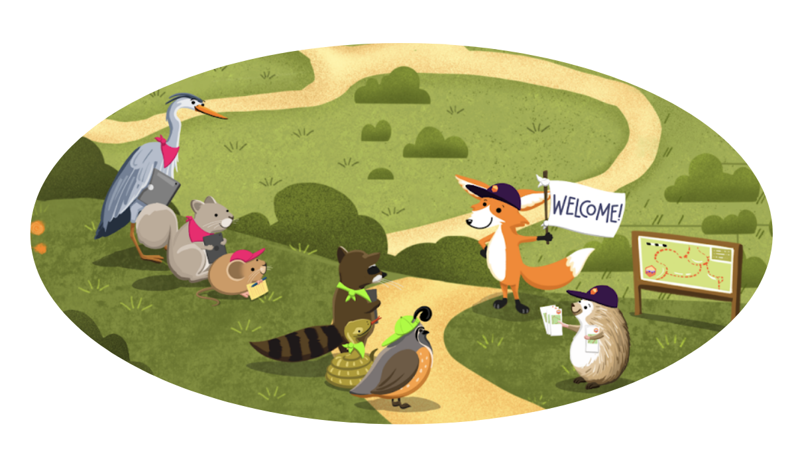

# 2026 SWRCB Fall

Welcome to the Fall 2024 California Water Boards Openscapes Champions Cohort! This is a Cohort for the California State and Regional Water Boards ([SWRCB](https://www.waterboards.ca.gov/), "Water Boards"), with the Instruction Team led by staff from the Office of Information Management and Analysis ([OIMA](https://www.waterboards.ca.gov/resources/oima/)) and the Division of Water Quality (DWQ). For more information, visit [Openscapes at the Water Boards](https://cawaterboarddatacenter.github.io/swrcb-openscapes/).

## Cohort Call Agendas

We will meet as a Cohort via Microsoft Teams five times over two months for 2 hours, on alternating Tuesdays in August, September, and October 2024:

- **Dates:** August 25, September 8 & 22, October 6 & 20
- **Times:** 10:00 am - 12:00 pm PT
- **Location:** remotely, via Microsoft Teams

Agenda links below are only accessible to Cohort participants, as they are also an archive of our of our shared notes. Please see <https://openscapes.org/series> for more detail and to view blank versions of the agendas. 

|  Date  |  Cohort Call Agendas  |  Presentation Slides  |  Openscapes Lessons  |  Between Cohort Calls  |
|---------------|---------------|---------------|---------------|---------------|
| 08/25 | 1\. Openscapes mindset | mindset, better science for future us  | [mindset](https://openscapes.github.io/series/core-lessons/mindset.html), [better science for future us](https://openscapes.github.io/series/core-lessons/better-science.html) | Seaside Chat (reflection, orient to the Pathway) |
| 09/08 | 2\. Culture & safety and Intro to the Pathway & Seaside Chats prep | culture & safety, pathway & seaside chats | [team culture](https://openscapes.github.io/series/core-lessons/team-culture.html), [pathways](https://openscapes.github.io/series/core-lessons/pathways.html) | Seaside Chat (Pathway trailhead); Optional Co-working  |
| 09/22 | 3\. GitHub for publishing and Documentation | GitHub for publishing, documentation | [GitHub for publishing](https://openscapes.github.io/series/core-lessons/github/github-pub.html), [documentation](https://openscapes.github.io/series/additional-lessons/documentation.html)  | Seaside Chat (organizing with GitHub; documentation needs); Optional Co-working |
| 10/06 | 4\. GitHub for project management and Data strategies for future us | GitHub for project management, data strategies | [GitHub for project management](https://openscapes.github.io/series/core-lessons/github/github-issues.html),[data strategies](https://openscapes.github.io/series/core-lessons/data-strategies.html) | Seaside Chat (Pathways); Optional Co-working  |
| 10/20 | 5\. Pathways share  | No Slides |  [Pathways](https://openscapes.github.io/series/pathways.html), [Open communities](https://openscapes.github.io/series/core-lessons/communities.html)  |    |

## Co-working calls (optional)

Co-working sessions are where we get our own work done at the same time together. Sometimes, this means quiet work with check-ins to break up focused work and get feedback, and sometimes this involves asking questions and screensharing to learn and problem solve. We will make breakout rooms so people working on related themes can meet and learn from each other.

- **Dates:** September 15 & 29, October 13
- **Times:** 11:00 am - 12:00 pm PT
- **Location:** remotely, via Microsoft Teams

## Cohort Participants

Some brief information about participating teams and individuals. 
*Participants - Please add any edits directly (we’ll learn how in our GitHub lessons!)*

- Individuals:
  - Add your info here!
- Teams:
  - Add your info here!

## Openscapes Instruction Team
Instructors: Anna Holder (OIMA), Tina Ures (DWQ)
Mentors: Magnolia Busse (DWQ), John Herrera (DIT)
Guest Teachers
- Call 1: Shannon Rankin (NOAA Fisheries) - Better Science for Future Us
- Call 3: Gregor Siegmund (UCLA) - Documentation
- Call 4: Rachael Blake & Kate Wing (Intertidal) - Data Strategies for Future Us

## More about Openscapes and the Champions program:

- [**Our path to better science in less time using open data science tools**](https://www.nature.com/articles/s41559-017-0160) (Lowndes et al. 2017) - This describes a marine science team’s transition to open collaborative teamwork. It was the original inspiration for creating the Champions Program and heavily influences the Core Lessons. We’ll ask that everyone participating reads it before our first Cohort Call.
- [**Supercharge your research: a ten-week plan for open data science**](https://openscapes.github.io/supercharge-research/) (Lowndes et al. 2019) - This was co-authored with the inaugural Champions Cohort, capturing the most valuable take-aways for marine and environmental science early career faculty.
- [**Shifting institutional culture to develop climate solutions with Open Science**](https://onlinelibrary.wiley.com/doi/10.1002/ece3.11341) (Lowndes et al. 2024) - This was co-authored by Openscapes mentors across organizations – including NASA Earthdata, NOAA Fisheries, US EPA, California Water Boards, Pathways to Open Science, Fred Hutch Cancer Center.
